# Employee Attendance and Leave Manager

A Python project for BrightPath Solutions (6 employees). It marks daily
attendance, handles leave with balances, skips weekends and holidays,
and produces monthly attendance reports.

## Features
- Mark attendance (P / WFH / A); approved leave is filled in automatically
- Apply CL / SL leave: counts only working days, checks the balance, blocks overlaps
- View a day, employee monthly summary, team report (flags below 75%)
- Data saved to text files and loaded when the program starts

## Built with
Python, datetime, defaultdict, sets, dictionaries, lambda, file handling.
Phase 2 web app: Streamlit and pandas.

## How to run
Console program: `python attendance_manager.py`

Web app: `pip install -r requirements.txt`, then `streamlit run app.py`

## Attendance % rule
(Present + WFH) / (Working days - Leave days) x 100

## Screenshots

### Console program
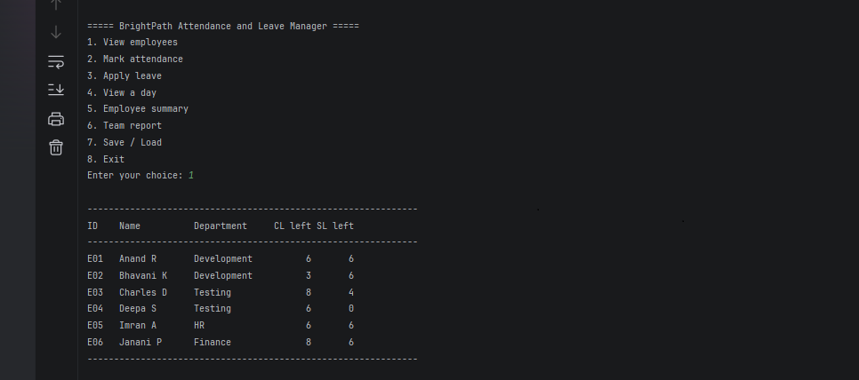
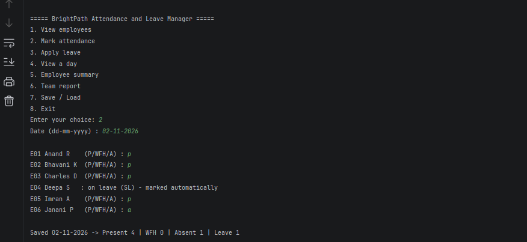
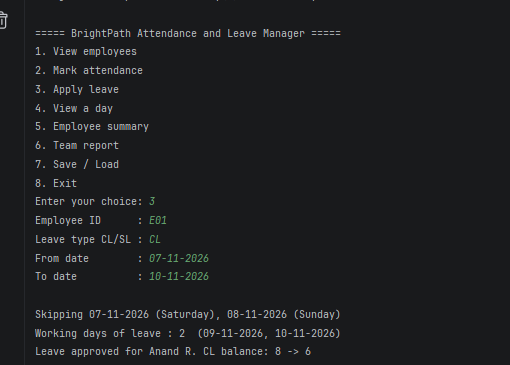
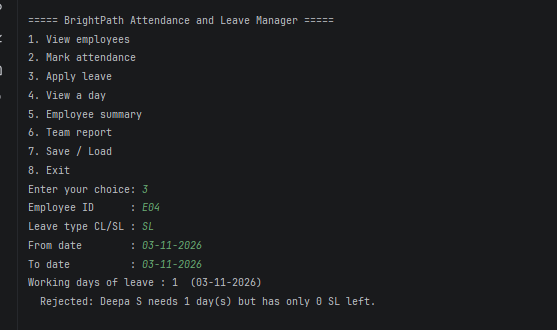
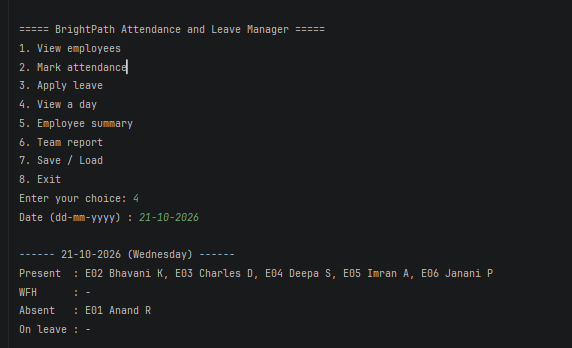
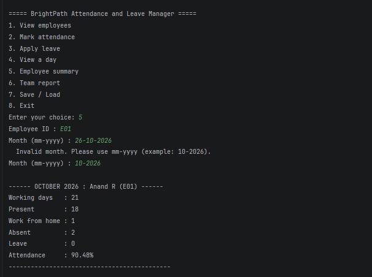
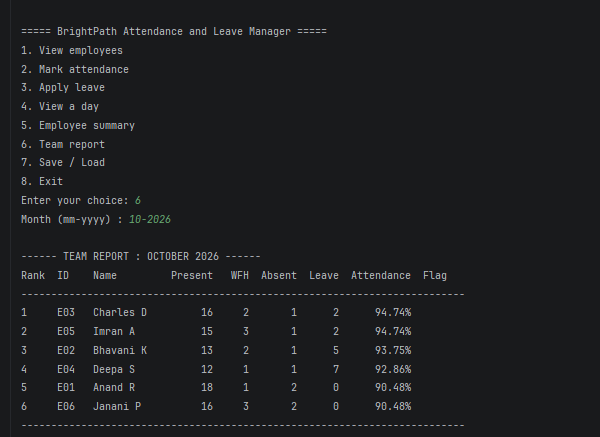
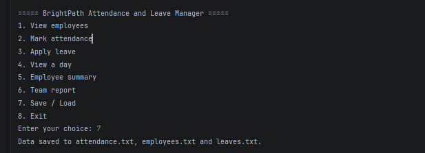
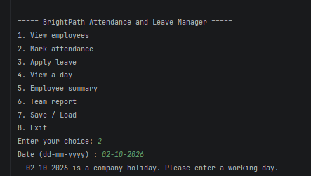
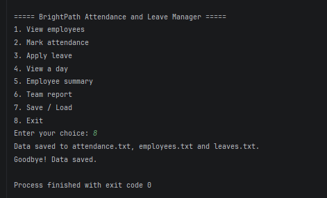

### Web app (Streamlit)
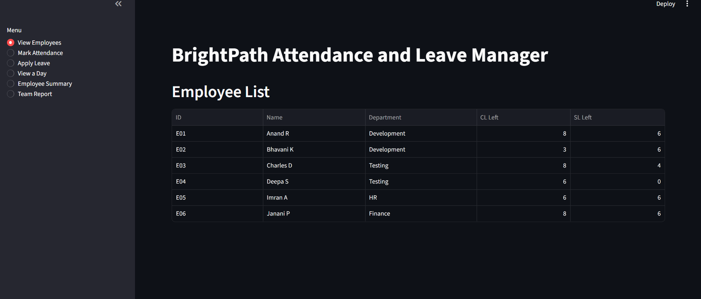
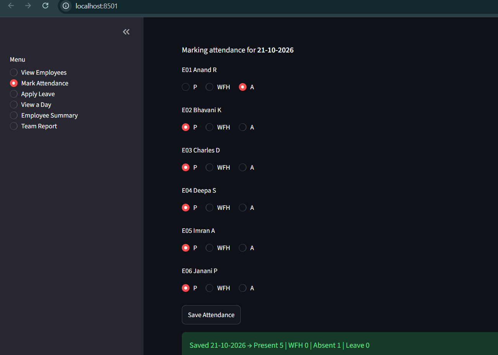
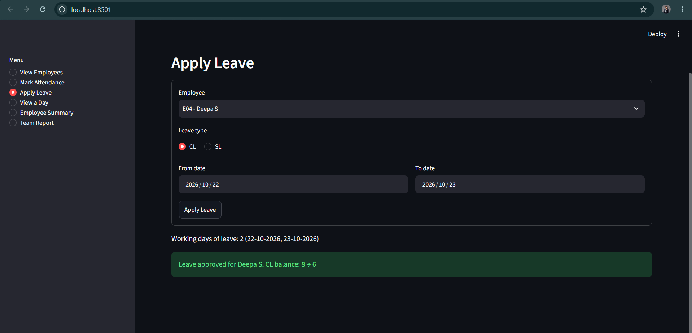
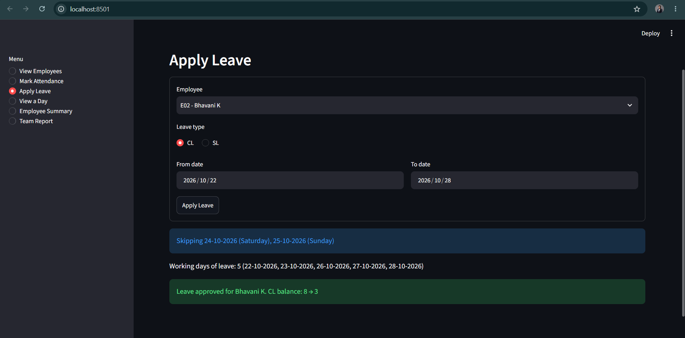
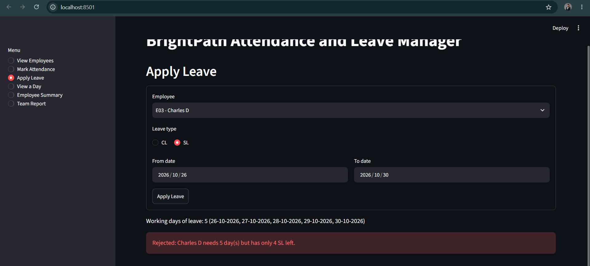
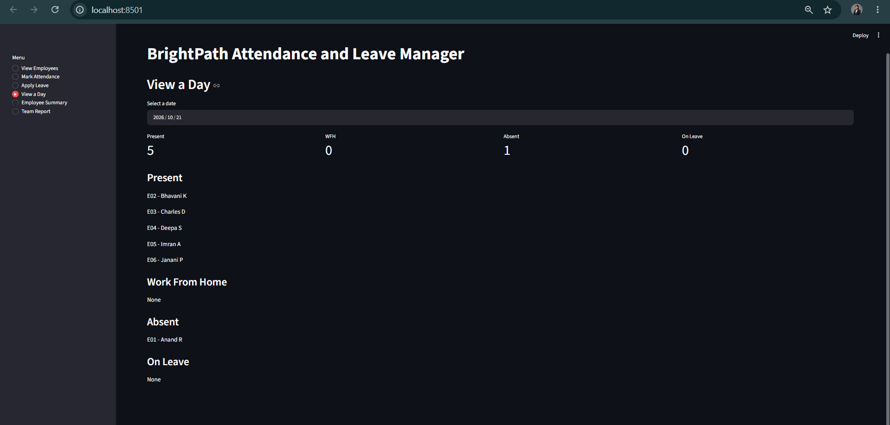
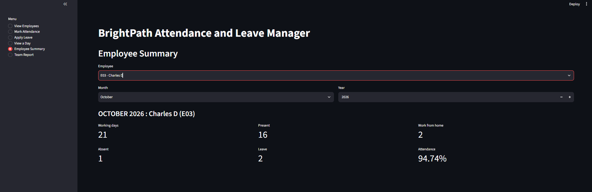
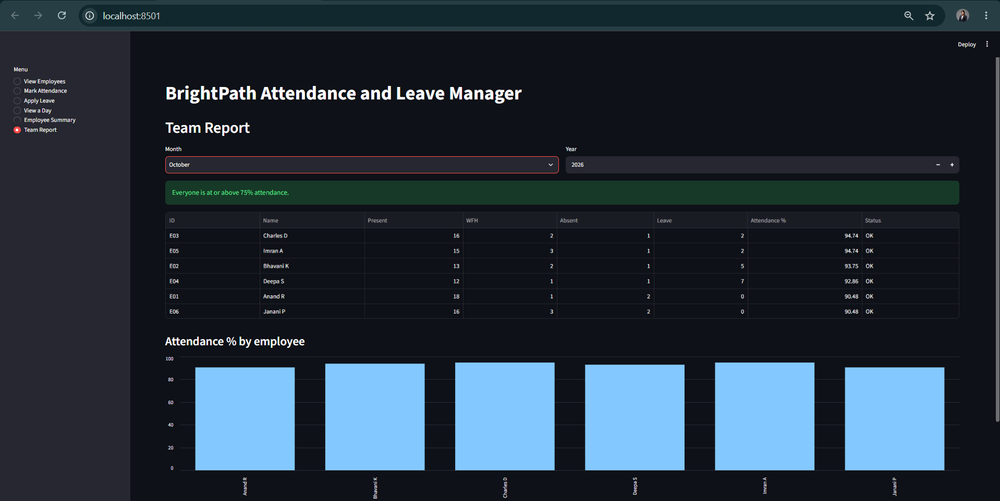